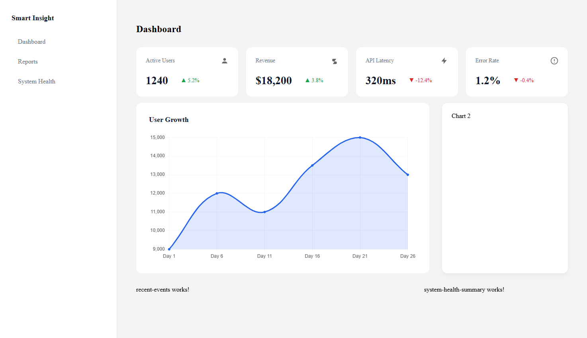

# Smart Insight

Smart Insight is a modern SaaS-style analytics and monitoring dashboard built with Angular.

The project explores scalable frontend architecture commonly used in real SaaS platforms, combining analytics, system monitoring, and product insights into a unified dashboard experience.

The goal of Smart Insight is to help teams understand product performance, monitor system health, and visualize key operational metrics.

This project is currently under active development.

---

# Screenshot



---

# Concept

Smart Insight is designed as a monitoring and analytics platform for digital products and internal business systems.

It helps teams:

• track key product KPIs
• analyze feature usage
• monitor system health
• detect anomalies in product performance
• visualize growth trends and operational metrics

The platform combines ideas from product analytics and system monitoring tools into a single dashboard.

---

# Current MVP

The current version focuses on building a strong frontend foundation.

The dashboard currently includes:

• KPI metric cards
• user growth visualization
• feature usage charts
• system health indicators
• recent system events

Mock data is currently used to simulate backend responses.

---

# Architecture

The project follows a scalable Angular architecture inspired by enterprise SaaS applications.

Key principles used in this project:

• feature-based folder structure
• dependency injection with singleton services
• separation of concerns
• reactive data streams using RxJS
• smart and dumb component architecture
• lazy-loaded routes

Project structure:

```
src/app

core
  services
  interceptors

shared
  components
  layout

features
  dashboard
  reports
  system-health

models
```

---

# Tech Stack

Frontend framework
Angular

Reactive programming
RxJS

Charts
Chart.js

Routing
Angular Router with lazy loading

Architecture patterns

• standalone components
• reactive state streams
• reusable UI components
• modular feature architecture

---

# Development Status

Smart Insight is currently in the **frontend architecture phase**.

Current focus:

• Angular architecture exploration
• reusable component design
• reactive data patterns
• scalable dashboard layout

Mock data is used temporarily while backend architecture is planned.

---

# Future Product Direction

Smart Insight is being developed as a flexible analytics and monitoring platform.

The long-term vision is to evolve the platform into a specialized SaaS product tailored for a specific niche where product analytics and operational insights provide the most value.

Potential directions include:

• analytics dashboards for SaaS startups
• monitoring tools for AI-powered applications
• operational analytics for small digital businesses

The architecture is intentionally modular so the platform can evolve toward a focused product market as development continues.

---

# Roadmap

### Phase 1 — Frontend Foundation

Dashboard layout
Routing architecture
Reusable UI components
Reactive data streams

### Phase 2 — Product Features

Role-based authentication
Advanced filtering and reports
Real-time data simulation
Error handling and resilience

### Phase 3 — Backend Integration

Backend API (Node or NestJS)
JWT authentication
Database integration
Multi-tenant architecture

### Phase 4 — SaaS Platform

Billing integration
User roles and permissions
AI-powered product insights
Cloud deployment

---

# Running the Project

Clone the repository:

```
git clone https://github.com/your-username/smart-insight.git
```

Install dependencies:

```
npm install
```

Run development server:

```
ng serve
```

Open in browser:

```
http://localhost:4200
```

---

# Vision

Smart Insight is being developed both as:

• a learning project focused on modern Angular architecture
• a potential SaaS analytics platform

The long-term goal is to evolve the project into a production-ready monitoring and analytics solution.

---

# Author

Nigora Kholmatova

